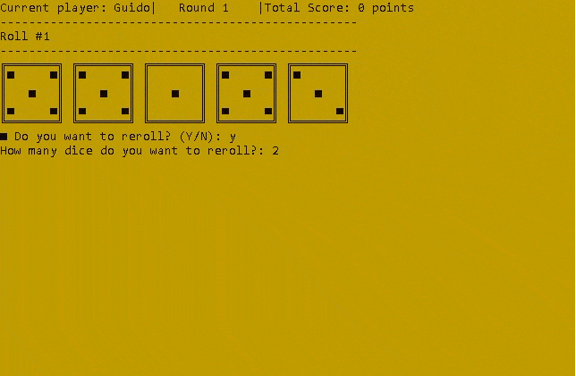
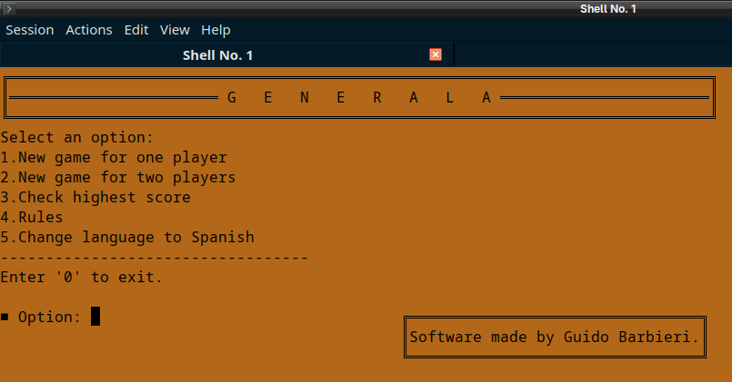
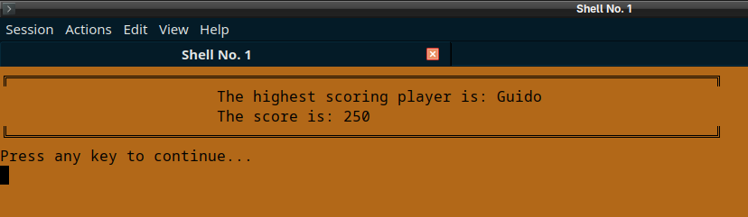

## 🎲 Generala C++: Cross-Platform Dice Game
A robust, modular implementation of the classic dice game "Generala", developed in C++ with a strong focus on software engineering principles, portability, and technical documentation.

<div align="center">
  
  <p><i>Gameplay demo: selective rerolls, dice animations depending on relevant dice, and Generala detection logic (and scoring).</i></p>
</div>

## ✨ Key Features
•	Native Cross-Platform: Designed to compile and run seamlessly on both Windows (CMD/Powershell) and Linux (Bash/Terminal).

•	Game Modes: Supports Single Player (Solo) and Local Multiplayer (Versus).

•	Terminal User Interface (TUI):

o	Utilizes the rlutil library for dynamic console manipulation and coloring.

o	Real-time dice animations using ASCII/Unicode art.

o	Bilingual Support: Dynamic in-game language switching (English/Spanish).

•	Debug Mode: Integrated developer tool for manual dice selection and logic testing.

## 🛠️ Technical Challenges & Solutions
This project goes beyond simple game logic, addressing low-level engineering challenges:

•	Memory Management & UB Mitigation: Resolved critical logic errors by strictly initializing primitive variables and controlling execution flows to prevent Undefined Behavior across different compilers (GCC/MinGW).

•	Input Buffer Hygiene: Implemented robust "buffer hygiene" logic using cin.ignore() and std::flush to synchronize input behavior between Windows and Linux environments, preventing "phantom reads" caused by residual newline characters.

•	Pass-by-Reference Optimization: Systematic use of const std::string& and references to minimize memory copying overhead and improve performance.

•	Cross-Platform UTF-8 Encoding: Configured Windows API (SetConsoleOutputCP) to ensure correct rendering of special characters, maintaining visual parity with Linux systems.

## 📂 Project Architecture

The codebase follows a modular architecture to ensure maintainability and scalability:

•	main.cpp: Entry point and main menu management.

•	game.cpp / .h: Core game loop, turn logic, and rules enforcement.

•	game_utils.cpp / .h: Helper functions for sorting algorithms, combination validation, and math.

•	ui_utils.cpp / .h: Presentation layer, rendering engines, and animations.

## 📖 Technical Documentation

The project includes comprehensive documentation generated via Doxygen and Graphviz.

•	Call Graphs: Visual representation of function hierarchy and modularity.

•	Dependency Graphs: illustrating the file structure and include relationships.
<div align="center">
  
  <p><i>Function hierarchy visualization (Call Graph) generated via Doxygen.</i></p>
</div>

## 🚀 Build & Run

### Prerequisites
You need a C++ compiler installed on your system.
* **Windows:** MinGW (g++) or similar.
* **Linux:** GCC (g++).

### Option A: Command Line (Recommended)

**Windows (PowerShell / CMD)**
```powershell
g++ -o generala.exe main.cpp game.cpp game_utils.cpp ui_utils.cpp
.\generala.exe
```
**Linux (Terminal)**
```Bash
g++ -o generala main.cpp game.cpp game_utils.cpp ui_utils.cpp
./generala
```
### Option B: IDE
You can also open the project using Code::Blocks (opening Generala.cbp) or Visual Studio Code (configuring tasks.json with the files listed above).

## 📸 Screenshots 
<table align="center">
  <tr>
    <td align="center"><b>English Interface</b></td>
    <td align="center"><b>Spanish Interface</b></td>
  </tr>
  <tr>
    <td></td>
    <td></td>
  </tr>
  <tr>
    <td colspan="2" align="center"><b>🏆 In-Memory Ranking System</b></td>
  </tr>
  <tr>
    <td colspan="2" align="center">
      
      <p><i>The system tracks high scores during the session, implementing sorting algorithms to rank players.</i></p>
    </td>
  </tr>
  <tr>
    <td colspan="2" align="center"><b>🗳️ Screen results.</b></td>
  </tr>
  <tr>
    <td colspan="2" align="center">
      
      <p><i>Game results.</i></p>
    </td>
  </tr>
</table>

## 👤 Author and Special Thanks
Guido Barbieri, Computer Programming Student UTN FRGP – Argentina

Special thanks to Tapio's [rlutil API](https://github.com/tapio/rlutil/tree/master?tab=readme-ov-file), it helped a lot during development.

This project will constantly evolve. Future updates will focus on code refactoring and optimizations, as well as improving some features like data persistance and fixing errors.
